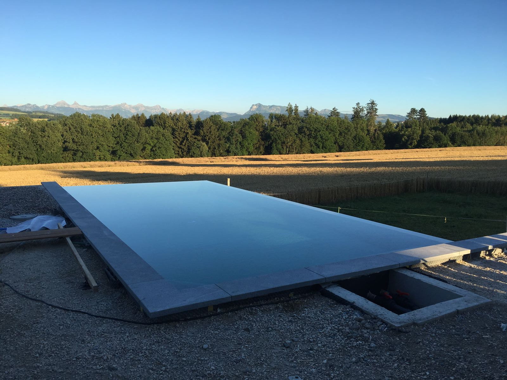
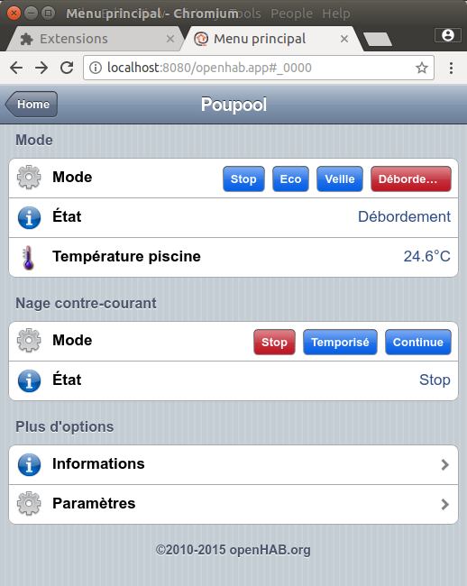

# Poupool - The swimming pool controller
Poupool is a swimming pool control software.

It is based on [Transitions](https://github.com/pytransitions/transitions),
[Pykka](https://www.pykka.org) and [Paho MQTT](https://github.com/eclipse/paho.mqtt.python).
The user interface is built using the excellent home automation server
[openHAB](http://www.openhab.org). Though, any MQTT client could be used to interact with the
system.

This is meant as a personal project and will likely never be a fully-featured software. However, it
would be awesome to see it running somewhere else. Poupool runs on a Raspberry Pi 3 Model B and most
of the hardware is COTS (commercial off-the-shelf). If you want more information, feel free to
contact me.

Originally, I wanted to experiment with asyncio but finally chose to go with some more traditional
approach (actor model and finite state machines).

Poupool currently controls filtration (including backwash), heating (heat pump), pH and
chlorination, cover, lights and all the pumps and valves of the system. It is used for an overflow
swimming pool so that adds some complexity to the control process (e.g. monitoring of the retention
tank water level).

The main interaction with the system is done through modes. Here are some of the main ones:

* **eco** : cover close, filtration, pH, chlorination and heating are automatic
* **standby** : cover open, no overflow
* **overflow** : cover open, overflow, chlorination is forced
* **comfort** :  cover open, no overflow, heating is forced

Several other features are available like a wintering state stiring the pool to avoid as long as
possible to have the water freezing, a stiring feature when the cover is closed to dissipate the
heat forming just under the cover, the control of a swimming pump and more.

Here is a screenshot of the main menu in openHAB 2.5M1:

Of course, you can use the iOS or Android openHAB clients, write your own HABPanel interface or
even use the REST API provided by openHAB.

## Dependencies

These are the external dependencies that can be install via `pip`. You will also need Python 3.5.
Best is to setup a virtual environment.

Frameworks:

* Pykka
* transitions
* paho-mqtt
* astral

Raspberry Pi:

* RPi.GPIO
* adafruit-circuitpython-ads1x15
* adafruit-circuitpython-mcp4725

User interface:

* openHAB 2.5

Development tools:

* autopep8
* pytest

