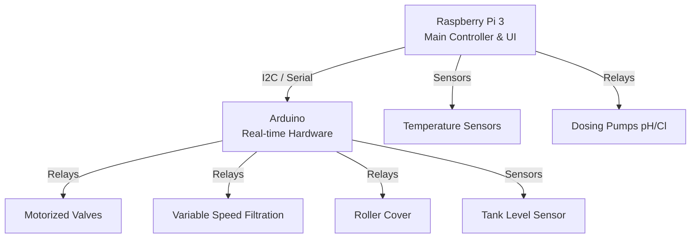
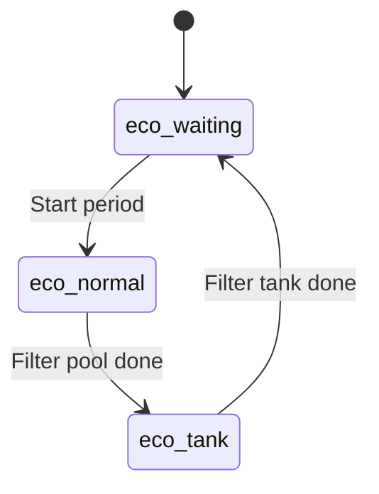
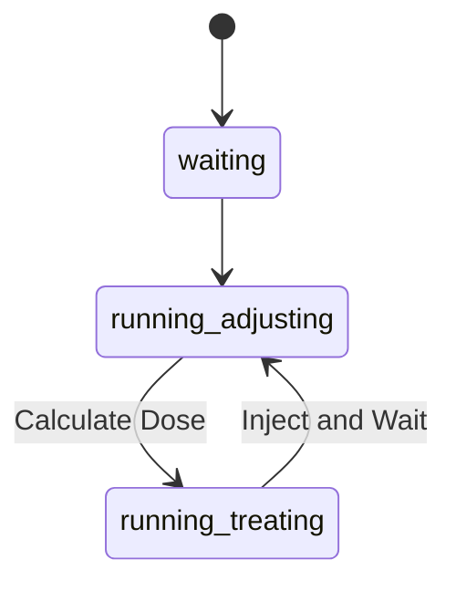

# Poupool User Manual

## Introduction
Poupool is an advanced, fully automated overflow swimming pool control software.
Unlike standard skimmer pools where the water level sits below the edge and surface debris is drawn into wall-mounted openings, an overflow pool keeps the water level perfectly flush with the surrounding deck. The water continuously spills over the edge into a perimeter gutter and flows into a dedicated buffer tank. This provides superior surface skimming, better water circulation, and a stunning "infinity edge" aesthetic. Poupool is explicitly designed to handle the complex valve and pump orchestration required to manage this buffer tank, alongside filtration, chemical disinfection (pH and ORP monitoring), heating (via a heat pump), the pool cover, underwater lights, multiple temperature sensors, and a variable-speed counter-current swimming pump.

All the hardware is COTS (commercial off-the-shelf) based on a Raspberry Pi 3 as the central brain, connected to an Arduino for real-time hardware interaction, relay boards, and standard electronic components easily available online.

---

## Hardware Architecture Diagram
Poupool is distributed across a main computer (Raspberry Pi) and a microcontroller (Arduino).

---

## Modes

Poupool uses the concept of *modes* to switch between functions. Some modes are only reachable via other modes and a requested mode might not be triggered if some pre-conditions are not met. You can always check the current mode in the user interface.

The modes can be split in two categories: the main modes which are most often used and the advanced modes which are used for special purposes.

### Main modes

#### Eco
This is the standard mode when the pool is not in use. In this mode, the filtration and disinfection will run automatically at given intervals and heating will be activated if required.

This mode is internally subdivided into several states. The standard flow is first to wait, then to filter the pool and finally to filter the tank. Those steps are repeated several times a day based on your configuration. The main settings are the total amount of hours of filtration per day and the number of periods.

##### Pool status
* Filtration is automatic
* Disinfection is automatic (pH and chlorine)
* Cover is closed
* Heat pump can run if needed
* Light is off
* Counter current pump is off

##### Reachable from
* Halt
* Stand-by
* Overflow

#### Stand-by
The Stand-by mode is used when the pool cover is open, but the pool is not actively overflowing into the buffer tank. Water circulation is redirected through the gravity line directly from the pool.

- **Valves:** Gravity valve is OPEN, Tank valve is CLOSED.
- **Filtration:** Runs at your configured stand-by speed.
- **Disinfection:** Only enabled if the filtration speed is greater than 0.
- **Features:** You can manually trigger a "Boost" which increases the pump speed significantly for 5 minutes. Heating will operate if necessary.

#### Overflow
The Overflow mode is similar to Stand-by, but the water actively overflows into the surrounding gutters and into the buffer tank. This provides the classic "infinity" look and is excellent for skimming the surface.

- **Valves:** Gravity valve is CLOSED, Tank valve is OPEN.
- **Filtration:** Runs at an intermediate or high speed to maintain the overflow edge.
- **Disinfection:** Automatically enabled as long as the pump is running at a moderate speed (high enough to flow, low enough for accurate sensor readings).
- **Features:** A "Boost" mode is also available here to quickly clear debris from the surface.

#### Comfort
Comfort mode is designed for when you are actively swimming.

- **Heating:** It overrides normal daily heating schedules and *forces* the heat pump ON to aggressively maintain your comfortable temperature setpoint.
- **Filtration:** Runs at an elevated speed (Speed 2) to handle bather load.
- **Disinfection:** Fully active.
- **Valves:** Depending on the `overflow_in_comfort` setting, the pool will either overflow to the tank or use the gravity line.

---

### Advanced modes

#### Sweep
Sweep mode is intended for intensive cleaning, typically when using a manual vacuum hose or a suction-side robot cleaner.
- **Configuration:** Gravity valve OPEN, Tank valve CLOSED.
- **Pumps:** Filtration pump is forced to Speed 3 (high suction). Disinfection is halted so concentrated chemicals aren't sucked up the vacuum.

#### Backwash
Sand filters need to be periodically backwashed to flush trapped dirt out to the drain. Poupool automates this complex valve orchestration.
- **Phase 1 (Backwash):** The system draws water from the buffer tank, runs the pump at high speed, and switches the automated backwash and drain valves to flush the filter.
- **Phase 2 (Rinse):** The valves adjust to rinse the sand bed and settle it before returning to standard operation.
*Note: A backwash cycle consumes water from the tank, which will be automatically refilled by the Tank logic.*

#### Wintering
Wintering protects the pool infrastructure from catastrophic freezing damage when temperatures drop.
- The pool cover is automatically commanded to OPEN completely (ice can crush the slats).
- The system continuously monitors the air temperature.
- If the temperature drops below the configured `only_below` threshold (e.g., 2°C), the system periodically wakes up and stirs the water at a set speed for a few minutes. Moving water is significantly harder to freeze than still water.

#### Halt
Halt mode is the emergency or maintenance stop.
- It aggressively shuts down all actors: Disinfection, Tank refilling, Arduino hardware interface, Heating, Lights, and the Swim pump.
- All valves are powered off and all pumps are deactivated.

---

## Heating Detailed Logic
Poupool manages the pool temperature using a connected heat pump, orchestrated by a robust state machine.

1. **Time Checks:** Heating is restricted to a daily cycle. It schedules its start time (e.g., waiting for the sun to come up).
2. **Temperature Constraints:** It will not run if the ambient air temperature is too low (e.g., below 15°C) because heat pumps become incredibly inefficient in the cold.
3. **Hysteresis:** Heating starts if `Pool Temp < Setpoint - Hysteresis Down`. It stops when `Pool Temp > Setpoint + Hysteresis Up`. This prevents the heat pump from short-cycling on and off repeatedly around the setpoint.
4. **Filtration Lock:** The heat pump cannot run unless the main filtration pump is pushing water through it. If heating finishes, Poupool enforces a mandatory cool-down delay (keeping the main pump running) to dissipate residual heat from the compressor.

---

## Disinfection Details
Disinfection is fully automated via proportional PWM controllers.

- **pH Control:** The controller calculates the difference between your desired pH (e.g., 7.2) and the current sensor reading. Since Poupool assumes "pH minus" is used, the system calculates a proportional dose and activates the acid pump via PWM for a maximum cycle of `PH_PWM_PERIOD`.
- **ORP Control:** Similarly, if the ORP drops below the setpoint (e.g., 650 mV), the controller computes the necessary dose of liquid chlorine and activates the chlorine pump.
- **Safety:** Both pumps feature a hardcoded `SECURITY_DURATION` limit. If the pump runs continuously for hours without reaching the setpoint (e.g., an empty chemical barrel or a broken sensor), the system shuts down the pump to prevent accidental massive chemical dumping.

---

## Tank Management
The buffer tank stores the water displaced by swimmers and provides the necessary volume for the overflow effect.

- **Level Sensors:** A continuous level sensor measures the height of water in the tank.
- **States:** The tank state machine transitions between `Halt`, `Fill`, `Low`, `Normal`, and `High`.
- **Dynamic Thresholds:** The required water level changes dynamically. In `Eco` mode, the tank is kept relatively empty to catch rainwater and reduce evaporation. In `Overflow` mode, the target level is raised higher to provide the necessary head pressure for the overflow edge.
- **Automatic Refill:** If the water drops below the `too_low` threshold, Poupool opens the main municipal water valve to refill the tank, implementing a hysteresis gap to prevent the valve from fluttering.
- **Empty Protection:** If the level stays critically low for too long, Poupool will emergency stop the entire filtration system to prevent the main pump from running dry.

---

## Swimming Pump
The swimming pump powers the counter-current swimming jets.
- **Modes:** It can be toggled to run `timed` (auto-shutoff after a specified duration) or `continuous`.
- **Interlocks:** It is strictly interlocked with the main filtration system. It will only activate if the pool is confirmed open (Stand-by, Overflow, or Comfort modes).
- **Variable Speed:** The jets can be adjusted by changing the speed parameter.
- **Winter Protection:** It has its own dedicated wintering logic, identical to the main filtration pump, to stir the counter-current pipes and prevent freezing.

---

## Light
Underwater pool lights are controlled via a simple toggle relay. The system switches between `on` and `halt` states to activate the illumination.

## Appendix: Knowledge Database

## Core Concepts Explained
To fully understand how Poupool manages your pool, it's helpful to grasp a few core chemical and control engineering concepts.

### What is pH?
pH is a scale used to specify the acidity or basicity of an aqueous solution. It ranges from 0 to 14:
- A pH of 7 is neutral.
- A pH less than 7 is acidic.
- A pH greater than 7 is basic (alkaline).

In a swimming pool, maintaining a pH between 7.0 and 7.4 is critical. If the pH is too high, the chlorine loses its effectiveness and scale can form on the pool walls. If it's too low, the water becomes corrosive to equipment and irritating to swimmers. Poupool automatically injects "pH minus" (acid) to lower the pH whenever it creeps above the target setpoint.

### What is ORP?
ORP stands for Oxidation-Reduction Potential, measured in millivolts (mV). While testing for "free chlorine" tells you how much chlorine is physically in the water, ORP tells you how *effective* that chlorine is at killing bacteria and oxidizing contaminants.
A higher ORP means the water is actively sanitizing. A typical target for a clean, safe pool is around 600 mV to 700 mV. If the ORP drops below your setpoint, Poupool activates the chlorine dosing pump.

### Proportional (P) Controllers
Poupool uses Proportional controllers (a simplified version of PID controllers) to manage chemical dosing smoothly.
Instead of simply turning a chemical pump on and leaving it on until the target is reached (which often leads to an overshoot, injecting too much chemical), a P-controller calculates an error: `Error = Setpoint - Current Value`.
The injection pump is driven using Pulse Width Modulation (PWM) where the duration the pump is turned ON is *proportional* to the error. If the pool is far from the target pH, the pump runs longer. As it gets closer to the target, it injects smaller and smaller doses, ensuring perfectly balanced water.

---
